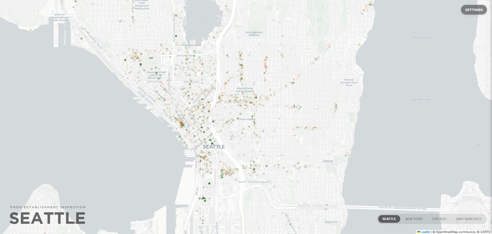
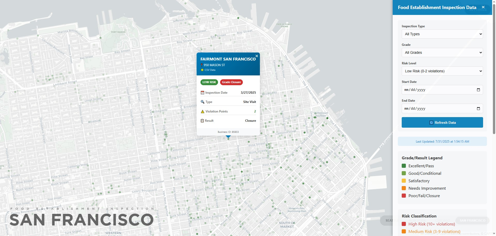

# Food Establishment Inspection Data

[Live preview](https://xuanx1.github.io/foodSafe/multi-city-inspection-map.html)



An editorial, Pudding/NYT-style data piece on restaurant health inspections in four US cities — Seattle, New York, Chicago and San Francisco. Public-health inspection records from each city's open data portal are mapped, normalised onto a single 0–100 quality scale, and ranked by district.



## What the piece does

- **Maps every recent inspection** as a single dot, colour-coded by risk.
- **Ranks districts by a Quality Index**: each inspection contributes 100 (low risk), 50 (medium) or 0 (high), and the district score is the mean. Districts with fewer than five inspections in the current filter view are dropped from the ranking.
- **Colours each district polygon** by its quality index — a choropleth fill on top of the city/zip outlines, so worst and best areas read at a glance.
- **Filters in-place**: change inspection type, grade, risk level or date range from the side panel; the map dots, the choropleth fill and the rankings all refresh together.

## The unified scale

Each city's inspectors record different things. We translate them into one scale so they can be compared:

| City | What inspectors record | Low (100) | Medium (50) | High (0) |
|---|---|---|---|---|
| Seattle | violation points | 0–4 | 5–14 | 15+ |
| New York | letter grade + points | Grade A (0–13) | Grade B (14–27) | Grade C or 28+ |
| Chicago | risk tier | Risk 3 | Risk 2 | Risk 1 |
| San Francisco | violations per visit | 0–2 | 3–9 | 10+ |

Districts are the natural reporting unit for each city — ZIP codes in Seattle and Chicago (annotated with neighbourhood names in the rankings), boroughs in New York and official neighbourhoods in San Francisco.

## Architecture

Single-page web app. No build step, no server, no live API at runtime.

- **D3 v7** for CSV/JSON parsing.
- **Leaflet v1.9.4** for the map, with a custom pane so the district choropleth sits beneath the inspection dots.
- **Vanilla JS** for the article and side-panel UI.
- **System fonts** only — Georgia for editorial copy, Helvetica Neue for UI.

The libraries are vendored under [vendor/](vendor/), so the only thing the page fetches from the network at runtime is the Carto basemap tiles.

## Data flow

Everything the page reads is local under [data/](data/):

```
data/
├── seattle-supplemental.json   # current-year inspections (King County Socrata)
├── nyc-supplemental.json       # current-year inspections (NYC DOHMH)
├── chicago-supplemental.json   # current-year inspections (Chicago Socrata)
├── sfo-supplemental.json       # current-year inspections (SFGov Socrata)
├── refresh-snapshots.sh        # re-downloads the four supplemental files
└── geo/
    ├── seattle-zips.geojson         (39 ZCTAs, 981xx)
    ├── nyc-boroughs.geojson         (5 boroughs — also serves as the city outline)
    ├── nyc-zips.geojson             (178 ZCTAs, not drawn by default)
    ├── chicago-city.geojson         (city boundary)
    ├── chicago-zips.geojson         (59 ZIPs)
    ├── sfo-city.geojson             (city boundary)
    └── sfo-neighborhoods.geojson    (37 neighbourhoods)
```

The four supplemental JSON snapshots are merged on load with the historical CSVs at the repo root (the originals from each city's open data portal). Records are deduplicated by business ID + inspection date so a live snapshot record overrides a CSV record for the same inspection.

### Refreshing the snapshots

```sh
bash data/refresh-snapshots.sh           # current year
bash data/refresh-snapshots.sh 2027      # a specific year
```

The script hits each city's classic Socrata `/resource/<id>.json` endpoint. Chicago's older `/api/v3/views/...` endpoint returns 403 since around 2026; the script uses the classic endpoint instead.

## Layout

The piece is structured as an article you scroll through:

1. **Hero** — kicker, headline, dek, byline.
2. **Lede** — two paragraphs with a drop cap.
3. **Map section** — bleeds wider than the article column. Map contained in a bounded block, with the city title overlay, city selector and filter button anchored to the map's corners.
4. **The Quality Index** — top-5 and bottom-5 district rankings, refreshes with city and filters.
5. **How to read this map** — the unified-scale table.
6. **Sources & caveats**.

The filter panel is a slide-out from the right that overlays the article. It controls the map, the rankings and the choropleth simultaneously.

## File structure

```
foodSafe/
├── multi-city-inspection-map.html         # the entire app
├── README.md
├── chicago-Food_Inspections_20250731.csv
├── nyc-DOHMH_New_York_City_Restaurant_Inspection_Results_20250726.csv
├── seattle-Food_Establishment_Inspection_Data.csv
├── sfo-Health_Inspection_Scores__2024-Present__20250731.csv
├── data/
│   ├── *-supplemental.json
│   ├── refresh-snapshots.sh
│   └── geo/
└── vendor/
    ├── d3.v7.min.js
    └── leaflet/
        ├── leaflet.js
        ├── leaflet.css
        └── images/
```

## Running locally

Open via a local web server (not `file://`, because the page uses `d3.csv` / `d3.json` which require HTTP):

```sh
python -m http.server 8000
# then open http://localhost:8000/multi-city-inspection-map.html
```

## Browser support

Modern browsers with ES2018+. The drop cap and `clamp()` typography assume Chrome/Edge 88+, Firefox 85+, Safari 14+.

## Notes & caveats

- Inspection records are imperfect — they describe one inspector's visit on one day, not the steady state of a kitchen.
- Seattle's open dataset has been quiet on 2026 inspections at time of writing; the historical CSV (covering 2025) still drives most of Seattle's view.
- ZIP-to-neighbourhood labels in the rankings are best-effort: one ZIP can span several neighbourhoods, so labels favour the most recognisable one.
- The SF neighbourhood polygons come from `codeforgermany/click_that_hood` (the city's own Socrata neighbourhood export currently returns empty geometries). Some neighbourhood names may not line up 1:1 with the `analysis_neighborhood` values in the SF inspection data.
